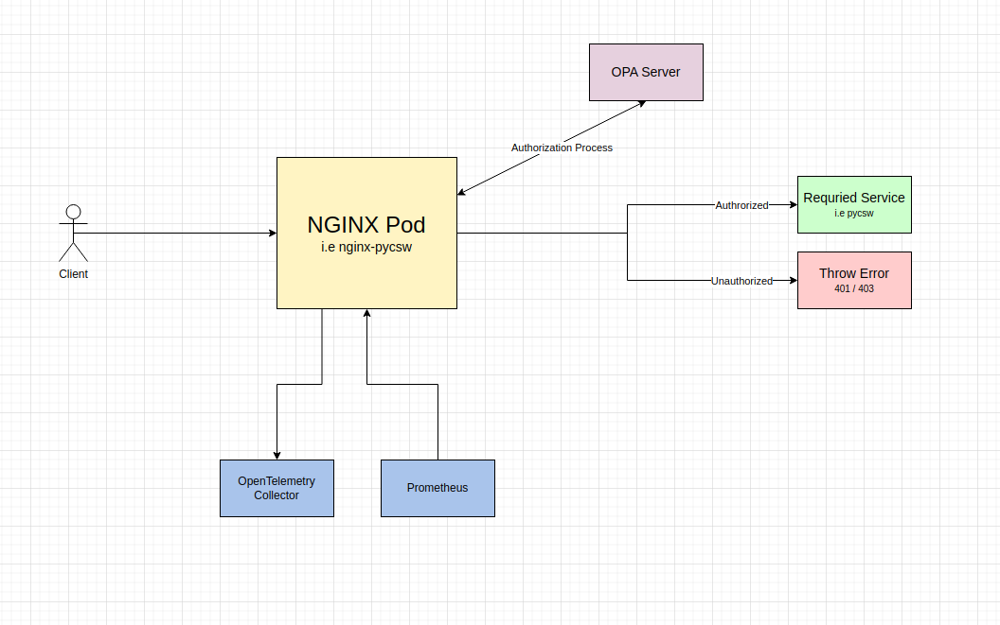

# NGINX Docker Image & Helm Chart for Openshift

## Application Architecture Overview


  

This repository consists of two things:

1. NGINX `Dockerfile` and its necessary assets for building

2. NGINX `Helm Chart` including `NGINX Prometheus Exporter`.

  
  

## Docker Image

We are using `nginxinc/nginx-unprivileged` as a base image in order to run NGINX with non-root privileges so it's possible to run it in an Openshift cluster (as we know, Openshift does not allow running containers with root privileges).

Besides that the `Dockerfile` is pretty straight forward so you can check it out yourself.

  

### Main Config Files

1.  `/etc/nginx/conf.d/deafult.conf` - Main server configurations. This server runs on port `8080` and it should process all of incoming traffic.

2.  `/etc/nginx/conf.d/status_site.conf` - This server runs on port `8081` and provides access to basic status data. You should use this server in order to make `liveness` checks on your application. This server **should not** be accessible outside the cluster.

  

### OpenTelemetry Support

There's support for instrumenting NGINX with OpenTelemetry (currently only for tracing), simply provide these environment variables:

  

| Environment Variable | Description | Default Value |
| ---------------------------- | ---------------------------------------------- | ---- |
| `OTEL_SERVICE_NAME` | Name of service | `nginx-proxy` |
| `OTEL_EXPORTER_OTLP_ENDPOINT` | Endpoint address of OpenTelemetry Collector | `localhost:4317` |
| `OTEL_TRACES_SAMPELR` | Sampling method | `AlwaysOff` |
| `OTEL_TRACES_SAMPLER_RATIO` | Sampling ratio | `0.1` |
| `OTEL_TRACES_SAMPLER_PARENT_BASED` | Use parent-based sampling | `false` |

  

### Authroization Mechanism

Since we are using [Open Policy Agent](https://www.openpolicyagent.org/) (aka `OPA`) as our gatekeeper, it's necessary to integrate NGINX with it.

* The docker image contains the `auth.js` file, which is responsible for handling requests that require authorization **but** the NGINX server does not actually handle the authorization process - we commented the code section responsible for this logic.

  

### Log Format

The docker image provides default log format (`/etc/nginx/log_format`). It's not possible to extend the log format, so if you'd want to add/remove certain fields you have to override it.

  
  

## Helm Chart

There is also an Helm Chart for deploying this NGINX in an Openshift environment (let alone any K8S environment). 
Besides NGINX, this Helm Chart also deploys (on deamend) a Prometheus exporter for NGINX using [nginx-prometheus-exporter](https://github.com/nginxinc/nginx-prometheus-exporter/). Follow the parameters below in order to configure NGINX and its Prometheus exporter as you wish.

### Parameters

These are the main parameters you should adjust when you deploy this Helm Chart. You can find all parameters in the `values.yaml` file.

  #### NGINX Parameters

| Name | Description | Value |
| ------------------------------------ | ----------------------------------------------------------- | ------- |
`nameOverride` | String to partially override fullname template (will maintain the release name) | `""`
`fullnameOverride` | String to fully override fullname template	 | `""`
`image.repository` | Docker image name | `nginx`
`image.tag` | Docker image tag | `latest`
`resources.enabled` | Use custom resources | `true`
`resources.value.limits.cpu` | Pod CPU limit | `100m`
`resources.value.limits.memory` | Pod memory limit | `128Mi`
`resources.value.requests.cpu` | Pod CPU request | `100m`
`resources.value.requests.memory` | Pod memory request | `128Mi`
`additionalPodAnnotations` | Use this property in order to add custom annotations to the Pod | `{}`
`env.opentelemetry.serviceName` | OpenTelemetry service name to be associated your NGINX application | `nginx`
`env.opentelemetry.exporterEndpoint` | OpenTelemetry Collector endpoint address | `localhost:4317`
`env.opentelemetry.samplerMethod` | OpenTelemetry sampling method | `AlwaysOff`
`env.opentelemetry.ratio` | OpenTelemetry sampling ratio | `0.1`
`env.opentelemetry.parentBased` | Use OpenTelemetry parnet-based sampling | `false`
`authorization.enabled` | Use authroization mechanism | `true`
`authorization.domain` | Your authorization domain | `example`
`authorization.url` | Authorization endpoint | `http://localhost:8181/v1/data/http/authz/decision`
`route.enabled` | Expose NGINX as an Openshift route | `true`
`route.path` | Path of route | `/`
`route.host` | Host of route | ` `
`route.timeout.enabled` | Use custom timeout duration of the route | `false`
`route.timeout.durationSeconds` | Set the timeout duration of the route. Defaults to 30s by Openshift | `60s`
`route.rewriteTarget` | Rewrite route target | ` `
`route.tls.enabled` | Use route over HTTPS | `true`
`route.tls.termination` | Set the termination of the route | `false`
`route.tls.insecureEdgeTerminationPolicy` | Policy for traffic on insecure schemes like HTTP | `false`
`route.tls.useCerts` | Use custom certificates for the route | `false`
`route.tls.certificate` | Set the certificate of the route | ` `
`route.tls.key` | Set the key of the route | ` `
`route.tls.caCertificate` | Set the CA certificate of the route | ` `
`ingress.enabled` | Expose NGINX as an Ingress | `false`
`ingress.path` | Path of ingress | `/`
`ingress.host` | Host of ingress | `localhost`
`ingress.domain` | Domain of ingress | `example.com`
`ingress.tls.enabled` | Use ingress over HTTPS | `true`
`ingress.tls.secretName` | Secret name of ingress that points to the relevant custom certificates | ` `
`extraVolumes` | List of extra *volumes* that are added to the **Deployment** | `[]`
`extraVolumeMounts` | List of extra *volumeMounts* that are added to the **NGINX container** | `[]`
`sidecars` | String consists of a list of sidecars containers that are added to the **Deployment** | ``

#### Overriding NGINX configuration files
If you wish to override the default configuration files, you can do it by providing an external ConfigMap and supplying Volumes & VolumeMounts that'll be added to the Deployment.
In this example we override the `default.conf` file by creating a ConfigMap and overriding the `extraVolumes`, `extraVolumeMounts` and `sidecars` sections:
```
apiVersion: v1
kind: ConfigMap
metadata:
  name: nginx-extra-configmap
data:
  default.conf: {{ tpl (.Files.Get "config/default.conf") . | quote }}
```

And then, in the `values.yaml` file:
```
...
extraVolumes:
  - name: nginx-extra-config
    configMap:
    name: 'nginx-extra-configmap'
extraVolumeMounts:
  - name: nginx-extra-config
    mountPath: "/etc/nginx/conf.d/default.conf"
    subPath: default.conf
sidecars:
 - name: envoy
   image: "envoyproxy/envoy:v1.20.7"
   volumeMounts: []
   args: []
   ports: []
   resources: {}
...
```

#### Adding Custom Annotations
There's an option to dynamically add annotations to the pod. You might find it useful if you operate on different environments and need to custom your annotations. It can be done by editing the `additionalPodAnnotations` parameter.

  #### NGINX-Prometheus-Exporter Parameters
  | Name | Description | Value |
| ------------------------------------ | ----------------------------------------------------------- | ------- |
`prometheusExporter.enabled` | Enable / Disable the Prometheus exporter | `false`
`prometheusExporter.image.repostiory` | Prometheus exporter Docker image name | `nginx/nginx-prometheus-exporter`
`prometheusExporter.image.tag` | Prometheus exporter Docker image tag | `true`
`prometheusExporter.image.pullPolicy` | Image pull policy | `100m`
`prometheusExporter.resources.enabled` | Use custom resources | `100m`
`prometheusExporter.resources.value.limits.cpu` | Pod CPU limit | `100m`
`prometheusExporter.resources.value.limits.memory` | Pod memory limit | `128Mi`
`prometheusExporter.resources.value.requests.cpu` | Pod CPU request | `100m`
`prometheusExporter.resources.value.requests.memory` | Pod memory request | `128Mi`
